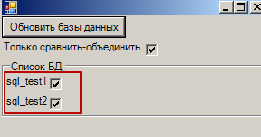

## Автоматическое объединение мини-конфигурации со списком баз 1С

Скрипт, написанный на **OneScript**: предназначен для сравнения-объединения конфигурации со списком баз данных. 

Создан с целью избавиться от рутины ручного сравнения-объединения: при наличии 3-х и больше баз, в которую нужно внедрить некую подсистему из мини-конфигурации это очень актуально. Во избежание ошибок имножество повторяемых действий.

**ВАЖНО**:

* использовать крайне акууратно, если Вы уверены, что объекты метаданных мини-базы (модули, команды, справочники...) не конфликтуют по названию с существующими объектами каждой из баз.
* Автоматическое обновление идет в "динамическом" режиме: то есть использовать следует, когда не изменяется структура БД.

### Описание комплекта

1. Главный скрипт располагается в корне репозитория: "main.os", в каталоге "./src" расположены вспомогательные модули. Для корректной работы в каталоге "OneScript" должна быть библиотека графического интерфейса "C:\Program Files (x86)\OneScript\bin\oscript-simple-gui.dll".

2. *Настройки для обработки баз данных* хранятся в файле "./fixtures/DBSettings.json".

   в файле содержатся параметры соединения к головной БД,  соединения с обновляемыми БД и прочие параметры

3. Пробный *файл настроек сравенения* хранится в файле "./fixtures/MergeSettings_БФДок.xml": содержит настройки сравнения/объединения с файлом.

4.  Тестовая конфигурация в файле "./fixtures/ПрисоединенныеФайлы.cf".

### Принцип работы

1. Основные доработки конфигурации производятся в головной базе, которая в json-файле настроек обозначена как "Главная БД":

   > "ГлавнаяБД":
   >   {
   >     "Имя":"БСД_ПрисоединенныеФайлы",
   >     "СтрокаПодключения":"/F\"D:\\Bases_1C\\ПрисоединенныеФайлы\"",
   >     "Пользователь":"admin",
   >     "Пароль":""
   >   }

2. Все дочерние базы, которые находятся в секции "БД" подлежат автоматическому сравнению- объединению с главной конфигурацией "Главная БД", доработки в дочерних базах НЕ производятся: см. секцию "БД":

   > "БД":
   >   [
   >     {
   >        "Имя":"sql_test1",
   >        "СтрокаПодключения":"/S\"BSDSQL01\\sql_test1\"",
   >        "Пользователь":"admin",
   >        "Пароль":""
   >      },
   >
   > ...

3. Если поведение функционала в различных конфигурациях отличается - то первоначальное сравнение-объединение - необходимо сначала произвести вручную - с указанием файла настроек сравнения "./fixtures/MergeSettings_БФДок.xml": см. скриншот

   

   В указанном примере ситуация, когда имеем общую команду "Doc_ПрисоединенныеФайлы"  и при этом в разных конфигурациях она должна прикрепляться к различным объектам метаданных. 

4. По окончанию последующих доработок конфигурации в базе "ГлавнаяБД" необходимо перенести эти доработки в другие конфигурации. При этом ни 1 из перечисленных в json-файле баз не должна быть открыта конфигуратором.

   Для автоматического объединения нажитмаем main.os - откроется окно визуального интерфейса обработки.

5. Выбираем базы данных для объединения с основной конфигурацией
  

6. Если достаточно просто сравнить-объединить без сохранения конйигурации БД - не снимаем флаг "только сравнить-объединить", тогда после отработки дочерняя конфигурация будет с "зеленым цилиндром":

7. Для сравнения-объединения  нажимаем "Обновить базы данных" - после этого читаем логи исполнения команды

